# ID Card Studio - Architecture Diagram

## Application Overview
Card Gen is a React + TypeScript web application for designing, customizing, and exporting professional ID cards. It features a drag-and-drop designer, template system, data import, and multi-format export capabilities.

## Tech Stack
- **Frontend**: React 19.2.0 + TypeScript 5.9.3
- **Build Tool**: Vite 8.0.16
- **Styling**: Tailwind CSS 3.4.19 + shadcn/ui components
- **State Management**: Zustand 5.0.14 (with localStorage persistence)
- **Authentication**: Firebase (Google, GitHub, Email/Password, Phone)
- **Backend**: Supabase 2.108.1
- **Export**: html2canvas 1.4.1 + jspdf 4.2.1
- **QR Codes**: qrcode.react 4.2.0
- **Icons**: Lucide React 0.562.0

## Architecture Diagram

```mermaid
graph TB
    subgraph "Entry Points"
        A[index.html] --> B[main.tsx]
        B --> C[App.tsx]
    end

    subgraph "Authentication Layer"
        D[Firebase Auth]
        D --> D1[Google OAuth]
        D --> D2[GitHub OAuth]
        D --> D3[Email/Password]
        D --> D4[Phone SMS]
        C --> D
    end

    subgraph "State Management"
        E[Zustand Store]
        E --> E1[Active Tab]
        E --> E2[Organization Data]
        E --> E3[Templates]
        E --> E4[Card Data List]
        E --> E5[Column Mappings]
        E --> E6[Export Settings]
        E --> E7[Designer State]
        E --> E8[localStorage Persistence]
    end

    subgraph "Main Layout"
        F[Layout Component]
        F --> F1[Navigation Sidebar]
        F --> F2[Header]
        F --> F3[Content Area]
        C --> F
    end

    subgraph "Feature Modules"
        G[Dashboard]
        H[Organization Setup]
        I[Template Gallery]
        J[Card Designer]
        K[Data Import]
        L[Preview & Export]
        
        F3 --> G
        F3 --> H
        F3 --> I
        F3 --> J
        F3 --> K
        F3 --> L
    end

    subgraph "Card Designer Subsystem"
        J1[DesignerCanvas]
        J2[DesignerToolbar]
        J3[LayersPanel]
        J4[PropertiesPanel]
        J --> J1
        J --> J2
        J --> J3
        J --> J4
    end

    subgraph "Shared Components"
        M[ColorPicker]
        N[ImageCollectionSection]
        O[QRFieldPicker]
        P[CardRenderer]
        Q[HelpDialog]
        R[Toast]
    end

    subgraph "Data Layer"
        S[Types Definitions]
        T[Firebase Client]
        U[File Utilities]
        V[Built-in Templates]
    end

    subgraph "Export Pipeline"
        W[html2canvas]
        X[jspdf]
        L --> W
        L --> X
    end

    C --> E
    G --> E
    H --> E
    I --> E
    J --> E
    K --> E
    L --> E
    
    J --> P
    H --> N
    J --> M
    J --> O
    C --> Q
    C --> R
    
    E --> S
    C --> T
    K --> U
    I --> V
```



## Data Flow

### Authentication Flow
```
User → LoginPage → Firebase Auth → User Session → App.tsx → Layout → Protected Routes
```

### Card Design Flow
```
Template Selection → CardDesigner → DesignerCanvas
                                    ↓
                            Element Manipulation
                                    ↓
                            PropertiesPanel
                                    ↓
                            LayersPanel
                                    ↓
                            Zustand Store (persisted)
```

### Data Import Flow
```
Excel/CSV Upload → DataImport → Parse Headers
                                    ↓
                            Column Mapping (AI-suggested)
                                    ↓
                            Preview Data
                                    ↓
                            Update Card Data List
```

### Export Flow
```
Card Data + Template → CardRenderer → html2canvas → Canvas
                                                        ↓
                                                jspdf → PDF/PNG
```

## Directory Structure

```
app/
├── src/
│   ├── components/          # React components
│   │   ├── designer/        # Card designer subsystem
│   │   │   ├── DesignerCanvas.tsx
│   │   │   ├── DesignerToolbar.tsx
│   │   │   ├── LayersPanel.tsx
│   │   │   └── PropertiesPanel.tsx
│   │   ├── shared/          # Shared UI components
│   │   │   ├── ColorPicker.tsx
│   │   │   ├── ImageCollectionSection.tsx
│   │   │   └── QRFieldPicker.tsx
│   │   ├── CardDesigner.tsx
│   │   ├── CardRenderer.tsx
│   │   ├── Dashboard.tsx
│   │   ├── DataImport.tsx
│   │   ├── HelpDialog.tsx
│   │   ├── Layout.tsx
│   │   ├── LoginPage.tsx
│   │   ├── OrganizationSetup.tsx
│   │   ├── PreviewExport.tsx
│   │   ├── TemplateGallery.tsx
│   │   └── Toast.tsx
│   ├── hooks/               # Custom React hooks
│   │   ├── use-mobile.ts
│   │   ├── useDesignerHistory.ts
│   │   ├── useDragResize.ts
│   │   ├── useFileUpload.ts
│   │   └── useImageCollection.ts
│   ├── lib/                 # Utility libraries
│   │   ├── firebase.ts      # Firebase configuration
│   │   ├── file-utils.ts    # File handling utilities
│   │   └── utils.ts         # General utilities
│   ├── pages/               # Page components
│   │   └── Home.tsx
│   ├── store/               # State management
│   │   └── index.ts         # Zustand store
│   ├── templates/           # Built-in templates
│   │   └── built-in.ts
│   ├── types/               # TypeScript definitions
│   │   └── index.ts
│   ├── App.tsx              # Root component
│   ├── App.css              # App-specific styles
│   ├── index.css            # Global styles
│   └── main.tsx             # Entry point
├── index.html               # HTML entry point
├── package.json             # Dependencies
├── vite.config.ts           # Vite configuration
├── tailwind.config.js       # Tailwind configuration
└── tsconfig.json            # TypeScript configuration
```

## Key Features

### 1. Authentication
- Multi-provider authentication (Google, GitHub, Email, Phone)
- Firebase-based user management
- Protected routes for authenticated users

### 2. Organization Setup
- Brand customization (colors, logos, signatures)
- Multiple logo and signature support
- Custom asset management (stamps, watermarks, banners)
- Organization details (address, contact info)

### 3. Template System
- Built-in templates for various use cases (corporate, school, medical, event)
- Custom template creation
- Template categories and descriptions
- Canva integration for advanced designs

### 4. Card Designer
- Drag-and-drop element positioning
- Element types: text, image, shape, QR code, barcode
- Layers panel for element organization
- Properties panel for fine-tuning
- Front/back card design
- Zoom and pan controls
- Undo/redo history

### 5. Data Import
- Excel/CSV file upload
- AI-suggested column mapping
- Manual mapping override
- Data preview
- Bulk card data management

### 6. Export Options
- PDF export (single or batch)
- PNG image export
- Print-ready format
- Progress tracking for batch exports
- Custom DPI settings

## State Management Structure

The Zustand store manages the following state:

```typescript
interface AppState {
  // Navigation
  activeTab: AppTab
  
  // Organization
  organization: Organization
  hasSetup: boolean
  
  // Templates
  templates: CardTemplate[]
  activeTemplateId: string | null
  
  // Card Data
  cardDataList: CardData[]
  activeCardIndex: number
  columnMappings: ColumnMapping[]
  
  // Export
  exportFormat: ExportFormat
  isExporting: boolean
  exportProgress: number
  
  // Designer
  designerSide: 'front' | 'back'
  selectedElementId: string | null
  zoom: number
  
  // UI
  showHelp: boolean
  toast: ToastMessage | null
}
```

## Type System

Core types defined in `src/types/index.ts`:

- **ElementType**: text, image, shape, qr, barcode
- **DataField**: name, role, code, dob, blood, contact, address, etc.
- **CardElement**: Individual design elements with position, style, and data bindings
- **CardTemplate**: Complete card design with front/back elements
- **Organization**: Organization branding and asset data
- **CardData**: Individual card holder information
- **ExportFormat**: pdf, png, print

## External Integrations

### Firebase
- Authentication providers
- User session management
- Password reset functionality

### Supabase
- Backend services (likely for data persistence)

### Export Libraries
- **html2canvas**: Captures DOM elements as canvas
- **jspdf**: Generates PDF documents from canvas/images
- **qrcode.react**: Generates QR codes from data

## Build & Development

```bash
# Development
npm run dev

# Build
npm run build

# Preview
npm run preview

# Lint
npm run lint
```

## Browser Support
Modern browsers with ES6+ support (Chrome, Firefox, Safari, Edge)
